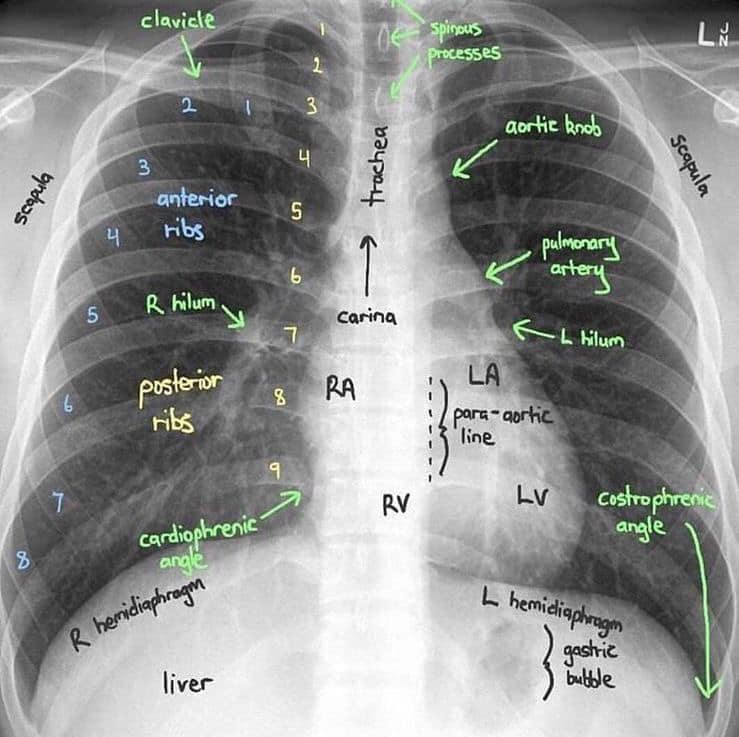

# X-rays
X-rays are a type of radiation called electromagnetic waves. X-ray imaging creates pictures of the inside of your body.
The images show the parts of your body in different shades of black and white.
This is because different tissues absorb different amounts of radiation.

## License
Copyright &copy; MedPocket. All rights reserved.

Licensed under the [CC0-1.0](LICENSE) license.

*Please bear in mind that we do not own copyrights to some software/books. We’re sharing this with our audience ONLY for educational purposes and we highly encourage our visitors to purchase original licensed software/books. If someone with copyrights wants us to remove some software/books, please contact us immediately.*
